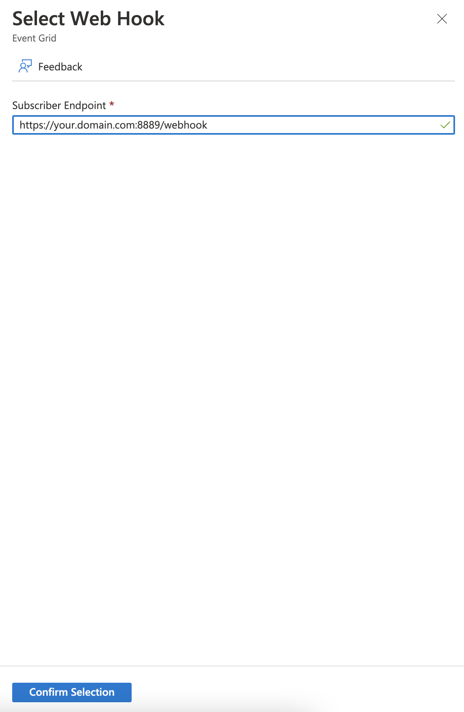

# azure-texting
send and receive SMS using python and Azure

### Send Text SMS Azure

To set up Text SMS send and receive capability through Azure I started [here](https://learn.microsoft.com/en-us/azure/communication-services/quickstarts/sms/send?tabs=windows&pivots=platform-azcli). 

To use the Python API to send messages you need to have a `sms client connection string` which you can only get by setting up a [Communication Services resource](https://learn.microsoft.com/en-us/azure/communication-services/quickstarts/create-communication-resource?tabs=windows&pivots=platform-azp). The `sms client connection string` has format

`send_connect_str = "endpoint=https://<Communication_Service_Name>.....4K=="`

which you will find in the left hand column menu under Tools -> Keys

You also need a phone number to be the phone number of the sender and receiver of these text messages. Inside your communication service you can get a new phone number under Telephony and SMS -> Phone numbers. 

using `pip install azure-communication-sms`

```python
from azure.communication.sms import SmsClient

sms_client = SmsClient.from_connection_string(send_connect_str)

sms_responses = sms_client.send(
    from_="+12223334444",
    to="+13125553333",
    message="Hello World via SMS",
    enable_delivery_report=True, # optional property
    tag="custom-tag-1"
) # optional property
```
### Receive Text SMS Azure using Webhooks

Upon Creating a Webhook, Azure will send a validation code to the endpoint you indicate. 
So you need to have an active endpoint ready to receive that handshake before you create your endpoint.




```python

# handshake.py

import requests

from flask import Flask, request

# Flask constructor takes the name of
# current module (__name__) as argument.
app = Flask(__name__)
app.debug = True
# The route() function of the Flask class is a decorator,
# which tells the application which URL should call the associated function.

@app.route('/webhook', methods=['POST', 'GET'])
def webhook():

    data = request.get_json()
    print("data\n\n",data,"\n\n")

    if 'validationCode' in data[0]['data']:
        validationCode = data[0]['data']['validationCode']
        print('validationCode found, initiate handshake ')
        myresponse = {'validationResponse': validationCode}
        json_object = json.dumps(myresponse, indent = 4)
        print("json_object\n\n",json_object,"\n\n")
        return json_object
    else:
        print('what is this?')
        return {'confirmed': 'confirmed'}
        
# main driver function
if __name__ == '__main__':
    
    # run() method of Flask class runs the application
    # on the local development server.
    app.run(
        host='0.0.0.0', 
        port=8889, 
        ssl_context=('/path/to/cert.crt','/path/to/server.key')
    )
    

# https://your.domain.com:8889/webhook
```

```console
python handshake.py
```

### Receive Text SMS Azure using Storage Queue

To receive text messages you need an [Event Grid and to Subscribe to SMS events](https://learn.microsoft.com/en-us/azure/communication-services/quickstarts/sms/handle-sms-events). 

Follow these steps to get to the image below:

1. Go to the Azure portal.
2. On the left menu, select Subscriptions.
3. Select the subscription that you use for Event Grid.
4. On the left menu, under Settings, select Resource providers.
5. Find Microsoft.EventGrid.
6. If your resource provider isn't registered, select Register.


Where I deviated fromt he instructions is that instead of subscribing to SMS events using Endpoint Type `Web Hook` I used `Storage Queues`. 

1. In the portal, go to the Communication Services resource that you created.

2. Inside the Communication Services resource, on the left menu of the Communication Services page, select Events.

3. Select Add Event Subscription.

4. When you `Select an endpoint` for your Storage Queue you will be brought to this image


5. Create new queue and name it if you havent already, or Select existing queue

6. Go to Home -> Storage accounts -> Name of Storage account (prodcaredotcoachsignals in above example) -> Data Storage (in left menu column) -> Queues -> name of Queue (client-sms in example) to see the incoming messages sent to your API phone number

7. To get the [Storage account connection string, which you need to programmatically receive messeages via Python](https://learn.microsoft.com/en-us/azure/storage/queues/storage-python-how-to-use-queue-storage?tabs=python%2Cenvironment-variable-windows). Go to Home -> Storage accounts -> Name of Storage account (...signals in above example) -> Security + Networking -> Access Keys. You will also need the name of Queue (client-sms in example). `queue_name = "client-sms"`

The storage connection string has the form

`receive_connect_str = "DefaultEndpointsProtocol=https;AccountName=...;AccountKey=...;EndpointSuffix=core.windows.net"`

using the `pip install azure-storage-queue`

```python
import os
import json
from azure.storage.queue import QueueServiceClient, BinaryBase64DecodePolicy

with QueueServiceClient.from_connection_string(receive_connect_str) as qsc:
    
    payloads =  qsc.get_queue_client(
        queue=queue_name,
        message_decode_policy=BinaryBase64DecodePolicy()
    ).peek_messages(max_messages=32)

    for payload in payloads:
    
        res = json.loads(payload['content'])
        
        if "message" in res['data']:
            print(payload['inserted_on'], res['data']['message'])
        else:
            print(payload['inserted_on'], res['data']['tag'])
```
